# About me

```{r,echo=FALSE, out.width='95%', fig.align='center'}

```

---
# Transcriptional regulators in prokaryotes
.center[
```{r,echo=FALSE,out.width='100%'}
library(DiagrammeR)
library(dplyr)
a_graph <-
  create_graph() %>%
  add_node(label = "Transcriptional \n regulation",node_aes = node_aes(shape = "rectangle",
                                                           fontsize = 8,
                                                           width = 1,
                                                           style = "rounded")) %>%
  add_node(label = "Sigma Factors",node_aes = node_aes(shape = "rectangle",
                                                           fontsize = 6,
                                                           width = 0.7,
                                                           style = "rounded")) %>%
  add_node(label = "Transcription \n Factors",node_aes = node_aes(shape = "rectangle",
                                                           fontsize = 6,
                                                           width = 0.7,
                                                           style = "rounded")) %>%
  add_node(label = "Riboswitches",node_aes = node_aes(shape = "rectangle",
                                                           fontsize = 6,
                                                           width = 0.6,
                                                           style = "rounded")) %>%
  add_edge(from = 1, to = 2) %>% 
  add_edge(from = 1, to = 3) %>% 
  add_edge(from = 1, to = 4)
render_graph(a_graph,layout = "tree")
```
]
---
# Transcriptional regulators in prokaryotes

### Sigma Factors

.pull-left[<br><br>
- Recognize the promoter sequence.

- Target the RNAP holoenzyme to specific promoters.

- Stabilize the single-stranded open complex.
]

.pull-right[
[
```{r,echo=FALSE,out.width='70%', fig.align='center'}
library(knitr)
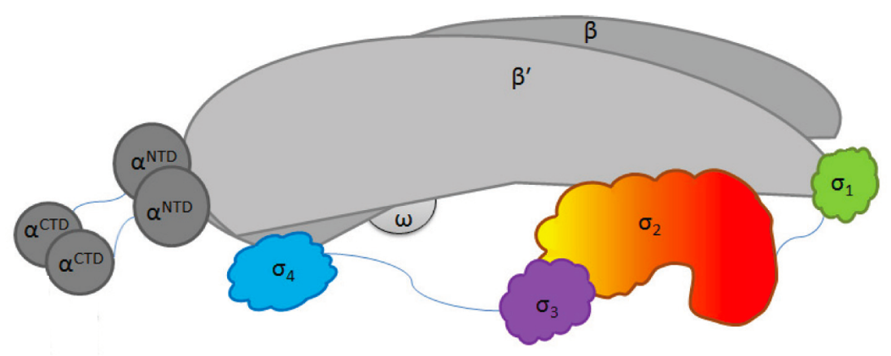
```
](https://cdnsciencepub.com/doi/10.1139/cjm-2016-0576?url_ver=Z39.88-2003&rfr_id=ori%3Arid%3Acrossref.org&rfr_dat=cr_pub++0pubmed&)
.right[Davis, *et al*, 2017]

[
```{r,echo=FALSE,out.width='85%',fig.align='center'}
library(knitr)
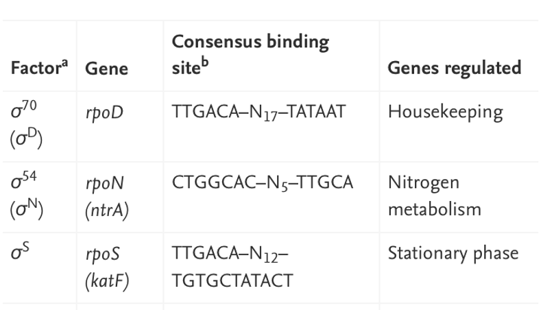
```
](https://www.sciencedirect.com/topics/biochemistry-genetics-and-molecular-biology/sigma-factor)
.right[Burgess, 2001]
]

---
# Transcriptional regulators in prokaryotes

### Transcription Factors 

.pull-left[<br><br>
- Transcriptional regulation in response to diverse environmental and cellular signals.

- Activators, repressors or dual activity.
]

.pull-right[
[
```{r,echo=FALSE,out.width='90%',fig.align='center'}
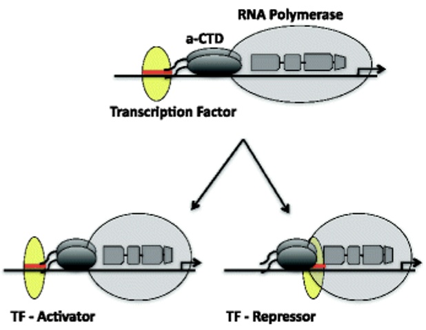
```
](https://link.springer.com/chapter/10.1007/978-90-481-9069-0_2)
.right[Narain-Seshasayee, *et al*, 2011]
]

---
# Databases used for clustering

<br><br>

.pull-left[
```{r,echo=FALSE,out.width='40%', fig.align='center'}

```

**Clusters of Orthologous Groups of proteins**

- Sequence comparison.
- 4631 groups of orthology.
- 91 groups of Transcription Factors.
- 4 groups of Sigma Factors.

]

.pull-right[
```{r,echo=FALSE,out.width='30%', fig.align='center'}
include_graphics("img/kegg.jpg")
```

**Kyoto Encyclopedia of Genes and Genomes**

- Sequence comparison.
- Functional classification.
- Emperimental evidence.
- 22557 groups of orthology.
- 369 groups of Transcription Factors.
- 9 groups of Sigma Factors.

]

---
# Transcriptional regulators in prokaryotes

### Riboswitches

.pull-left[

Riboswitches are composed of two domains:
- Aptamer.
- Expression platform.

[
```{r,echo=FALSE,out.width='90%'}
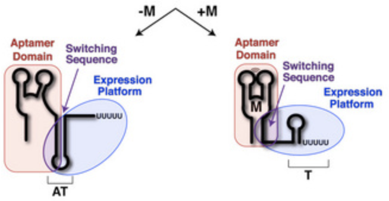
```
](https://www.nature.com/scitable/topicpage/riboswitches-a-common-rna-regulatory-element-14262702/#)
.right[Edwards, *et al*, 2010]
]

.pull-right[
Transcriptional atenuator
[
```{r,echo=FALSE,out.width='90%', fig.align='center'}
library(knitr)
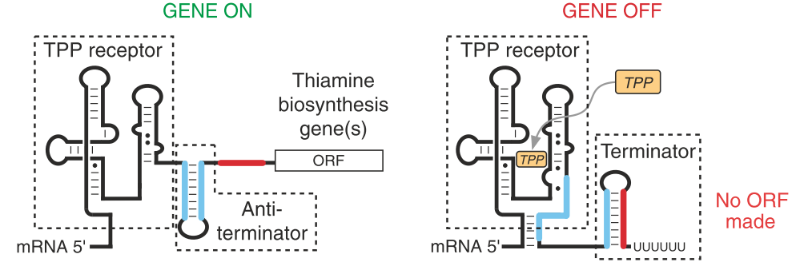
```
](https://www.nature.com/articles/nbt1268)
.right[Blount & Breaker, 2006]

Translational atenuator
[
```{r,echo=FALSE,out.width='90%', fig.align='center'}
library(knitr)
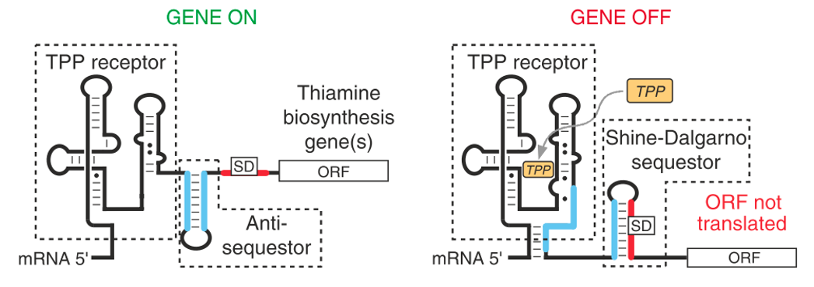
```
](https://www.nature.com/articles/nbt1268)
.right[Blount & Breaker, 2006]
]
---
#  Families of riboswitches deposited in the Rfam database
<br><br><br>
.pull-left[
[
```{r,echo=FALSE, out.width='50%', fig.align='center'}

```
](https://www.ncbi.nlm.nih.gov/pmc/articles/PMC165453/)
<br><br>
- 49 families of riboswitches.

-  Sequence comparison.

- Secondary structure.

.right[Griffiths-Jones, *et al*, 2003]
]

.pull-right[
.center[
**T-Box leader**
]
```{r,echo=FALSE, out.width='90%',fig.align='center'}
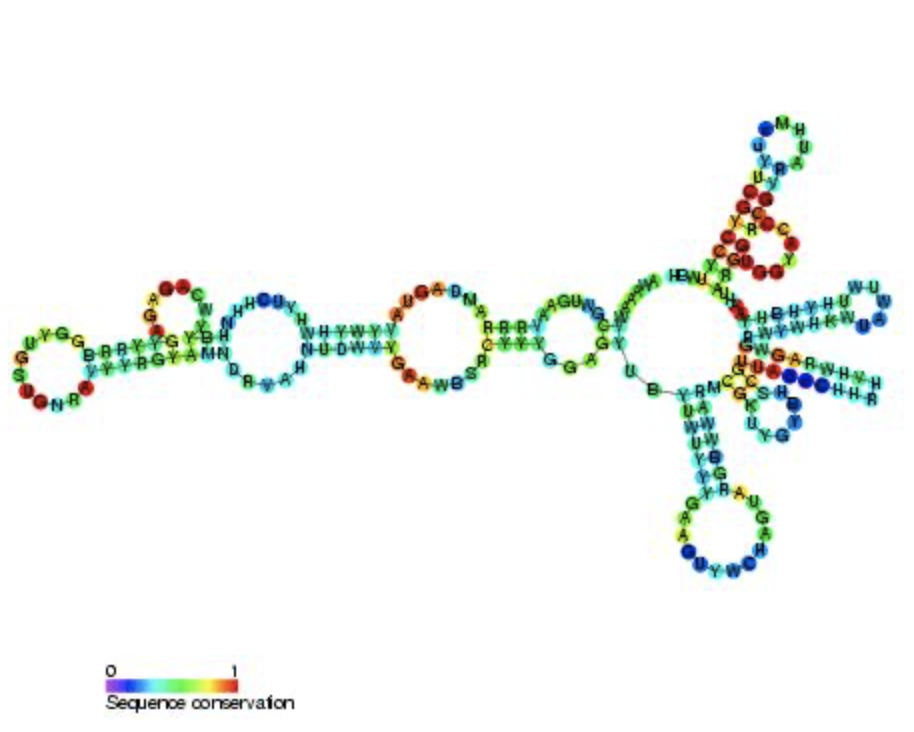
```

]

---
# The previously reported relationship between TFs and the genome size

.left-column[<br><br>
- A study of 90 bacterial and archaeal genomes.

- Free-living  organisms had the higher ratio of TFs.

- Intracellular parasites and pathogens had a lower ratio of TFs.

- The ratio of TFs/gene increases as the genome size.
]
.right-column[
[
```{r, echo=FALSE,out.width='100%'}
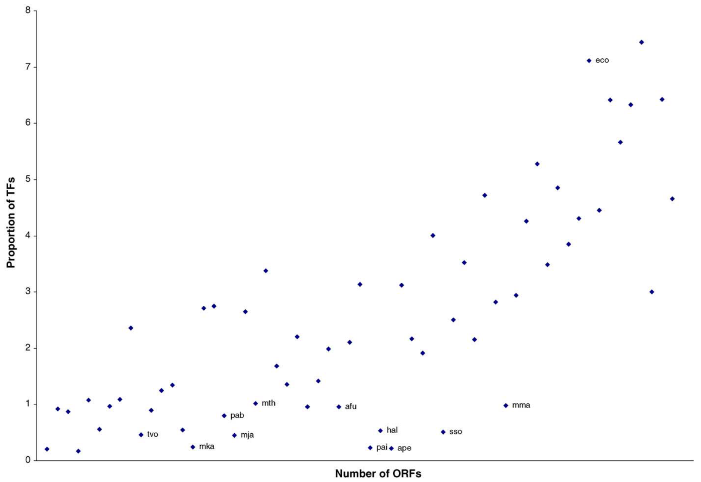
```
](https://www.sciencedirect.com/science/article/abs/pii/S1476927104000672?via%3Dihub)
.right[Pérez-Rueda, *et al*, 2004; Cases, *et al*, 2003]
]
---
.center[
# Our questions for the project
]
.pull-left[
```{r, echo=FALSE,out.width='100%',fig.align='center'}

```
]
.pull-right[<br><br><br><br>
.center[
**Families enrichment?**
]
```{r, echo=FALSE,out.width='40%', fig.align='center'}

```
]

---
class: chapter-slide

# *In silico* identification of transcriptional regulators.

---
# Genomes selection
<br>

.pull-left[
- 4852 bacterial genomes.
- 281 archaeal genomes.

**Avoiding redundant genomes**

```{r, echo=FALSE,message=FALSE}
library(dplyr)
library(kableExtra)
x <- tibble(Especie = c("Escherichia coli", "Escherichia coli"),
            cepa = c("DH1", "O145:H28"),
            CDS = c(4160,5776))
kable(x) %>% 
  column_spec(1,italic = TRUE,border_left = TRUE) %>% 
  column_spec(1:3,border_right = TRUE)
```

<br>
**Selection of a representative genome per specie**

```{r, echo=FALSE,message=FALSE}
library(dplyr)

x <- tibble(Especie = c("Escherichia coli"), 
            CDS = c(5776))
kable(x)%>% 
  column_spec(1,italic = TRUE,border_left = TRUE) %>% 
  column_spec(1:2,border_right = TRUE)
```
]

.pull-right[
```{r, echo=FALSE}
phylum <- tibble(phylum = c("Actinobacteria", "Bacteroidetes", "Chlamydiae", "Crenarchaeota", "Euryarchaeota", "Firmicutes", "Planctomycetes", "Proteobacteria", "Spirochaetes", "Tenericutes","Verrucomicrobia"), n = c(371,212,16,46,156,487,18,1271,48,87,8) )

kable(phylum)
```

Total:  
2518 bacterial genomes.  
202 archaeal genomes.
]

---
# Determining the number of transcription factors and sigma factors

.center[
**Transcriptional regulators count** ]
```{r,echo=FALSE}
x <- read.delim("data/table_cog.txt", header = TRUE, sep = "\t")
kable(x[c(1,2,5),c(1,4:7)], row.names = FALSE,align = 'c',format = "html",
      col.names = c("organismo",
                    "COG0568 (sigmaD/sigmaS/sigmaH)",
                    "COG1191 (sigmaF/SigB)",
                    "COG1508 (sigmaN)",
                    "COG1595 (ECF)")) %>% 
    kable_styling(position = "center") %>% 
  column_spec(1:5, border_left = TRUE)  %>% 
  column_spec(5, border_right = TRUE)
```

<br>

.center[
**Adding genome size and phylogenetic group data**]
```{r, echo=FALSE}
x <- read.table("data/table_ko.txt", header = TRUE)
kable(x[c(1,2,5),-6], row.names = FALSE, align ='c', format = "html",
      col.names = c("organismo",	"phylum",	"clase",	"CDS",	
                    "K02405 (sigmaF)",	"K03087 (sigmaS)",	"K03088 (ECF)")) %>%
    kable_styling(position = "center")%>% 
  column_spec(1:7, border_left = TRUE)  %>% 
  column_spec(7, border_right = TRUE)
```

---
# Prediction of transcriptional-acting riboswitches
<br>

.pull-left[
.center[**Search of riboswitches**]
<br>
```{r,echo=FALSE,out.width='40%', fig.align='center',fig.cap="Covariance matrix (Aptamer)"}

```
<br>
```{r,echo=FALSE,out.width='40%',fig.align='center'}

```
<br><br>
```{r,echo=FALSE,out.width='40%',fig.align='center', fig.cap="Intergenic regions"}

```
]

.pull-right[
**Prediction of transcriptional-terminator secondary structures**
<br><br>
[
```{r,echo=FALSE,out.width='70%',fig.align='center'}
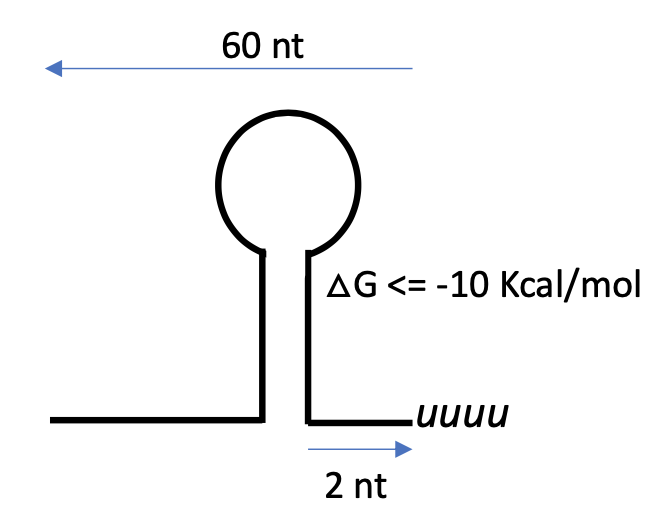
```
](https://www.asmscience.org/content/book/10.1128/9781555817992.chap23)
.right[Based on Merino & Yanofsky, 2002]

```{r,echo=FALSE,out.width='30%',fig.align='center'}

```
]

---
# The erba package
<br>
```{r, echo=FALSE,out.width='100%', fig.align='center'}
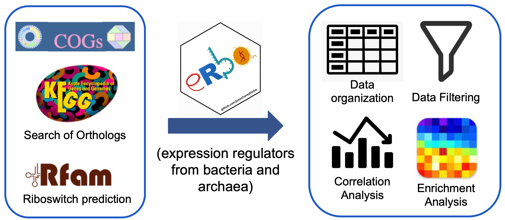
```
.center[https://github.com/josschavezf/erba]

---
# The number of transcriptional regulator proteins vary according to the database
<br><br>
.left-column[<br><br><br>
```{r,echo=FALSE,out.width='100%'}
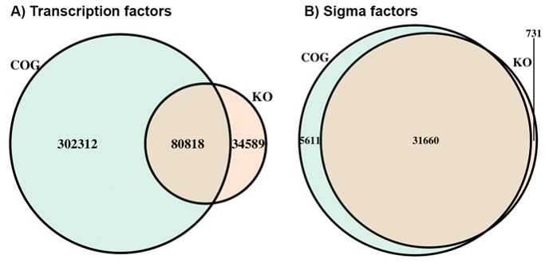
```
]

.right-column[
```{r,echo=FALSE,out.width='100%'}
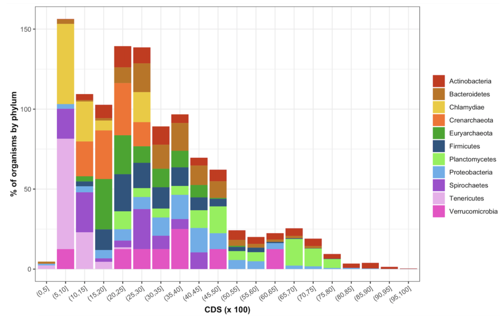
```
]
---
class: chapter-slide

# Determining the ratio of transcriptional regulators _vs_ the genome size.

---
# The number of transcriptional regulators have an incremental with the genome size
```{r,echo=FALSE,out.width='63%',fig.align='center'}
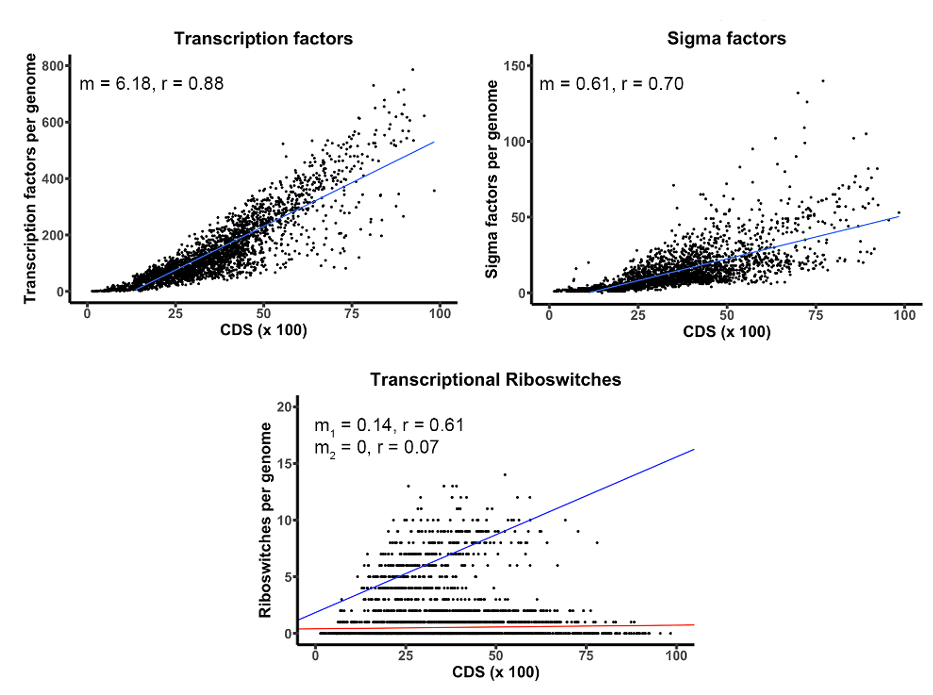
```

---
# The ratio of transcriptional regulators _vs_ the genome size is _phylum_ especific
```{r,echo=FALSE,out.width='63%',fig.align='center'}
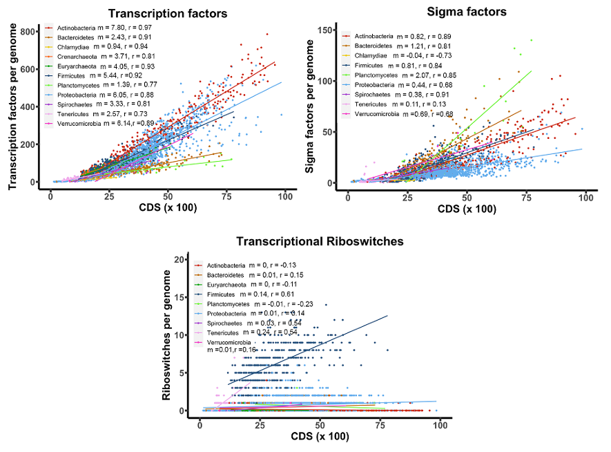
```

---
# The ratio of TFs *vs* SFs is particular for each *phylum*
```{r,echo=FALSE,out.width='73%',fig.align='center'}
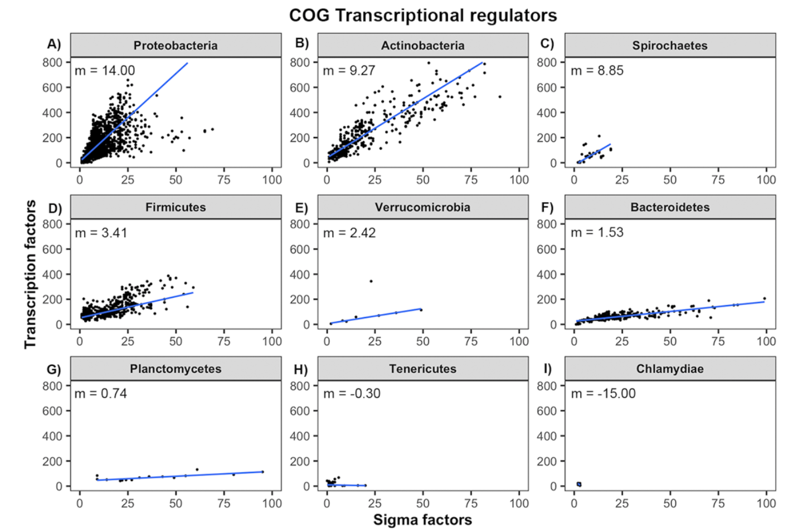
```

---
class: chapter-slide

# Enrichment analysis of transcriptional regulatory families.

---
# The families enrichment is *phylum* especific

.pull-left[
```{r,echo=FALSE,out.width='100%',fig.align='center'}
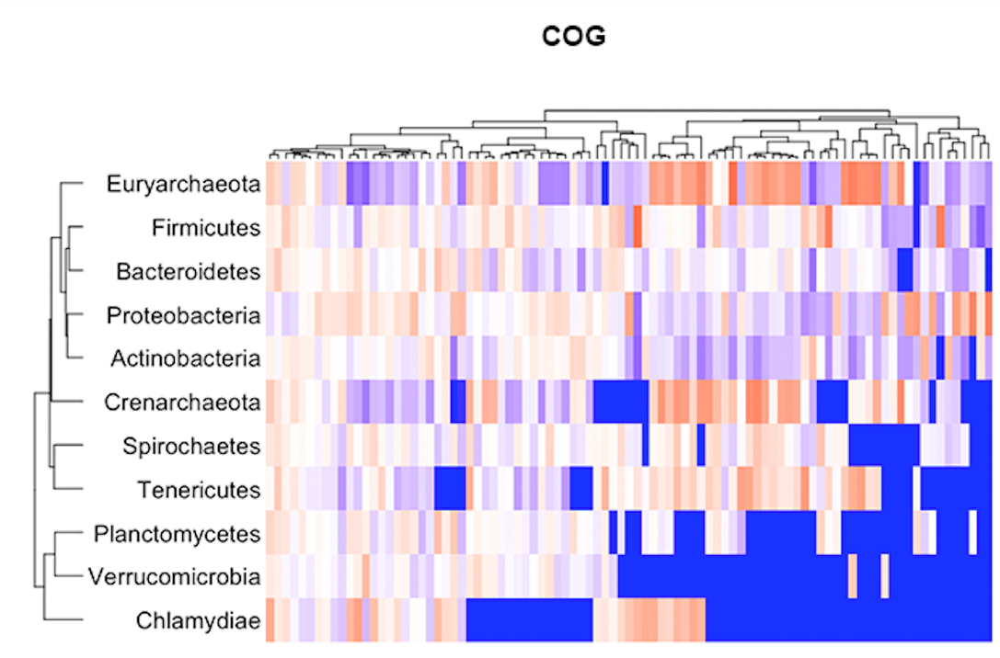
```
```{r,echo=FALSE,out.width='25%',fig.align='center'}
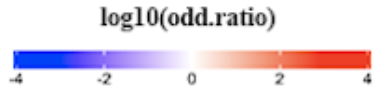
```

Broadly distributed families: 
- DtxR (COG1321) -> Iron metabolism.
- TFs with (HTH)-like domains (COG2865).
- GntR (COG1725) -> Nitrogen homeostasis and carbon metabolism.
]

.pull-right[
Archaeas
- TFs with HTH domain (COG3373).
- TFs involved in thiamine biosynthesis (COG1992).
- TFs with unknown function (COG1709).

Firmicutes
- CodY (COG4465) -> flageline regulation.
- ComK (COG4903) -> expression of competence genes.

Proteobacterias
- MltR (COG3722) -> antibiotics production.
- sigma54-dependent TFs (COG4650).
]

---
# The families enrichment is *phylum* especific

.pull-left[
```{r,echo=FALSE,out.width='100%',fig.align='center'}
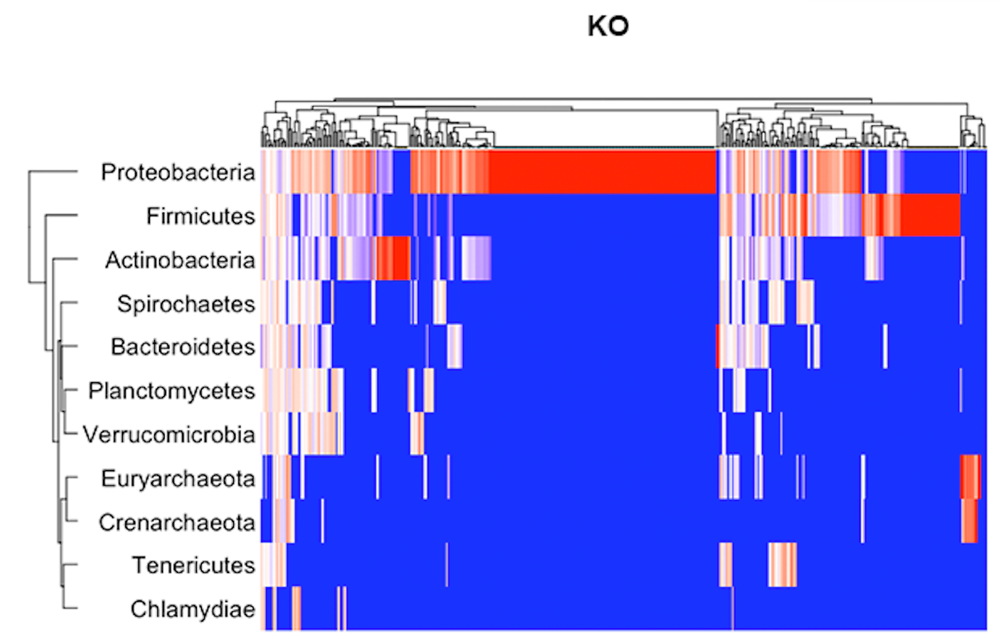
```
```{r,echo=FALSE,out.width='25%',fig.align='center'}

```

Proteobacteria (114 exclusive KOs)
- LysR -> virulence, metabolism, QS, motility.
- LuxR -> QS
- AraC -> antibiotics resistance.
- TetR/AcrR -> pathogenicity, efflux pumps.
]
.pull-right[<br>
Firmicutes (28 exclusive KOs)
- MarR -> efflux pumps, resistance.
- MerR -> oxidative stress response, heavy metals or antibiotics.

Actinobacterias (4 exlusive KO)
- WhiB-like -> lipid anabolism during infection and virulence.

Bacteroidetes (2 exclusive KO)
- CRP/FNR -> response to multiple environmental signals.
- HTH-type.

Archaeas (4 exclusive KOs with unknown function).
]
---
# The families enrichment is *phylum* especific

.center[**Sigma Factors**]
```{r,echo=FALSE,out.width='55%',fig.align='center'}
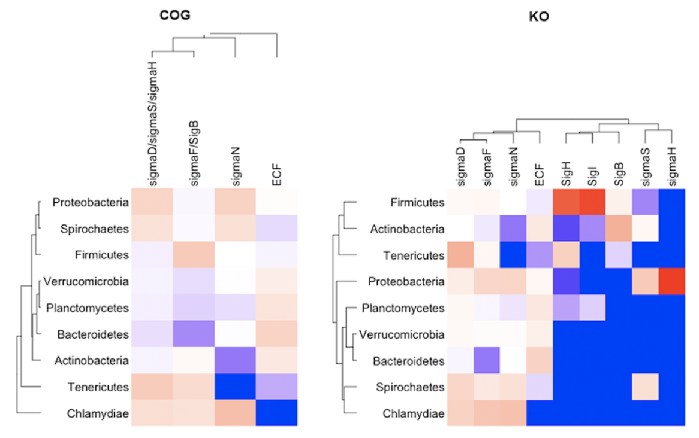
```

.pull-left[
- sigH -> Stationary phase and sporulation onset genesn.
- sigI -> Heat shock and survival at low temperatures.
]
.pull-right[
- sigmaH -> Heat shock response.  
- sigmaF is expressed in Chlamydia during the infection cycle and in response to heat shock.
]

---
# The riboswitches enrichment is *phylum* especific

.center[**Riboswitches**]

```{r,echo=FALSE,out.width='55%',fig.align='center'}
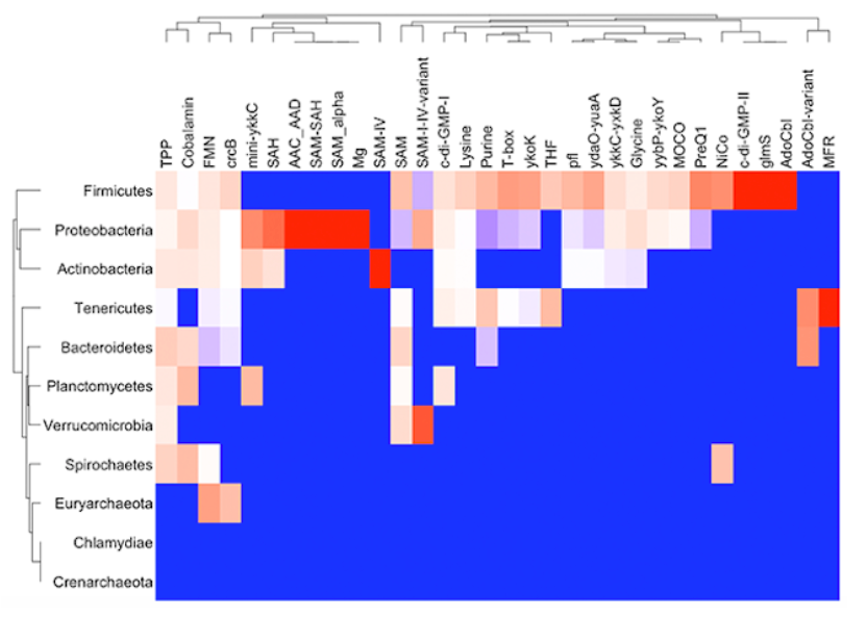
```
```{r,echo=FALSE,out.width='20%',fig.align='center'}

```

---
# Prediction of translational-acting riboswitches
<br>

.pull-left[
.center[**Search of riboswitches**]
<br>
```{r,echo=FALSE,out.width='40%', fig.align='center',fig.cap="Covariance matrix"}

```
<br>
```{r,echo=FALSE,out.width='40%',fig.align='center'}

```
<br><br>
```{r,echo=FALSE,out.width='40%',fig.align='center', fig.cap="Intergenic regions"}

```
]

.pull-right[
**Prediction of translational-attenuator secondary structure**
<br><br>
```{r,echo=FALSE,out.width='75%',fig.align='center'}
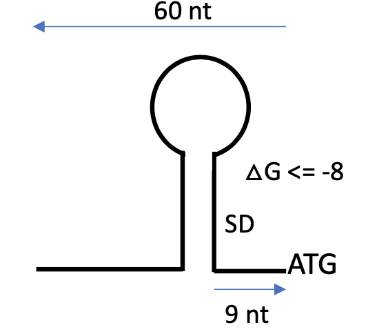
```

```{r,echo=FALSE,out.width='25%',fig.align='center'}

```
]

---
# The use of transcriptional or translational-acting riboswitches is *phylum* dependent
```{r,echo=FALSE,out.width='75%',fig.align='center'}
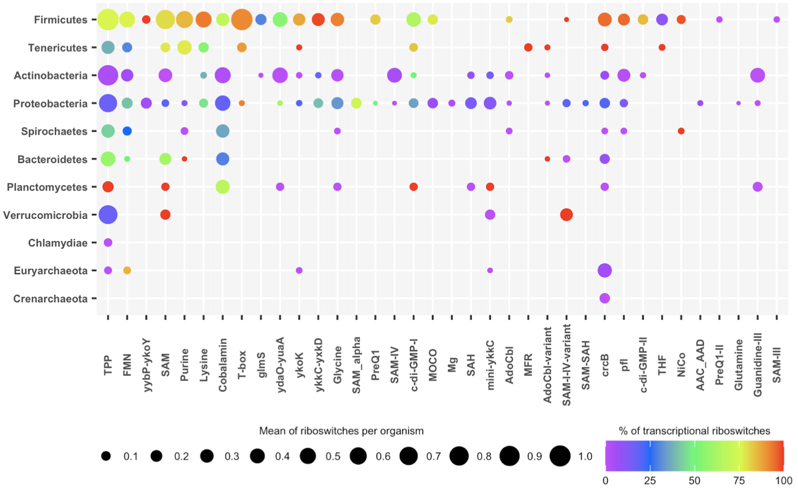
```

---
class: chapter-slide

# Analysis of the genomic context of transcriptional regulators.

---
# Operon prediction
<br><br>

.pull-left[
Using the program [Operon-mapper](https://www.ncbi.nlm.nih.gov/pmc/articles/PMC6247939/) de Taboada, *et al*, 2018. <br>

Operon-mapper evaluates:
- The intergenic distance between neighbor genes.
- The functional relationships among the encoded proteins.
]

.pull-right[
Frequency of TFs and SFs as:
- Monocystron.
- Operon head.
- Operon body.
]
<br>
```{r,echo=FALSE}
x <- read.delim("data/operones.txt")
kable(x,align = 'c') %>% 
  kable_styling(position = "center") %>% 
  column_spec(1:4,border_left = TRUE) %>% 
  column_spec(4,border_right = TRUE)
```

---
# Frequencies of TFs and SFs arranged in operon
<br><br><br>
.left-column-rev[
```{r, echo=FALSE,out.width='110%', fig.align='center'}
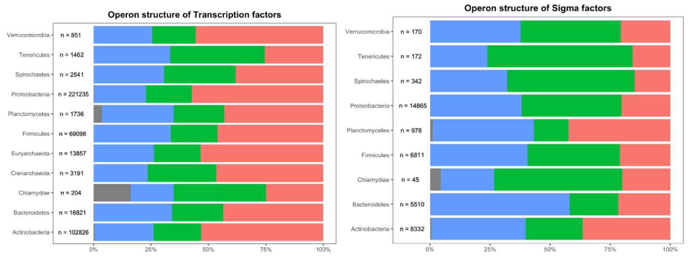
```
]
.right-column-rev[<br><br>
```{r, echo=FALSE,out.width='50%', fig.align='center'}
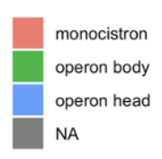
```
]
---
# Frequencies of main SFs families arranged in operon
```{r, echo=FALSE,out.width='80%', fig.align='center'}
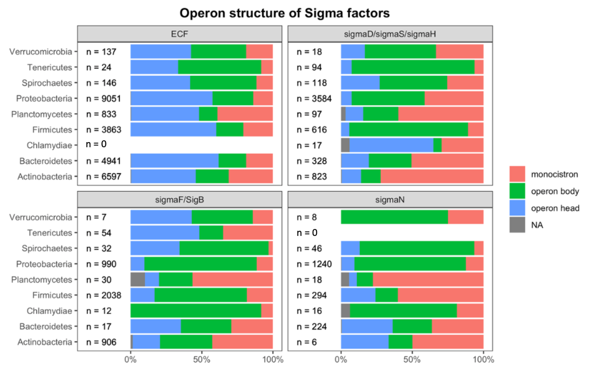
```
---
# Summary
<br>
1. The abundance of transcription factors and sigma factors maintains a relationship with the genome size. 

2. The ratio of transcription factors and sigma factors with genome size is *phylum* specific.

3. The enrichment of transcriptional regulatory families is *phylum* specific and related with the organisms life-style.

4. Exist *phylum* specific trends in the use transcriptional or translational acting riboswitches.

5. The genomic context of sigma factors vary depending on the protein family.

---
# Published Article (January 2021)

.center[
```{r, echo=FALSE,out.width='55%', fig.align='center'}
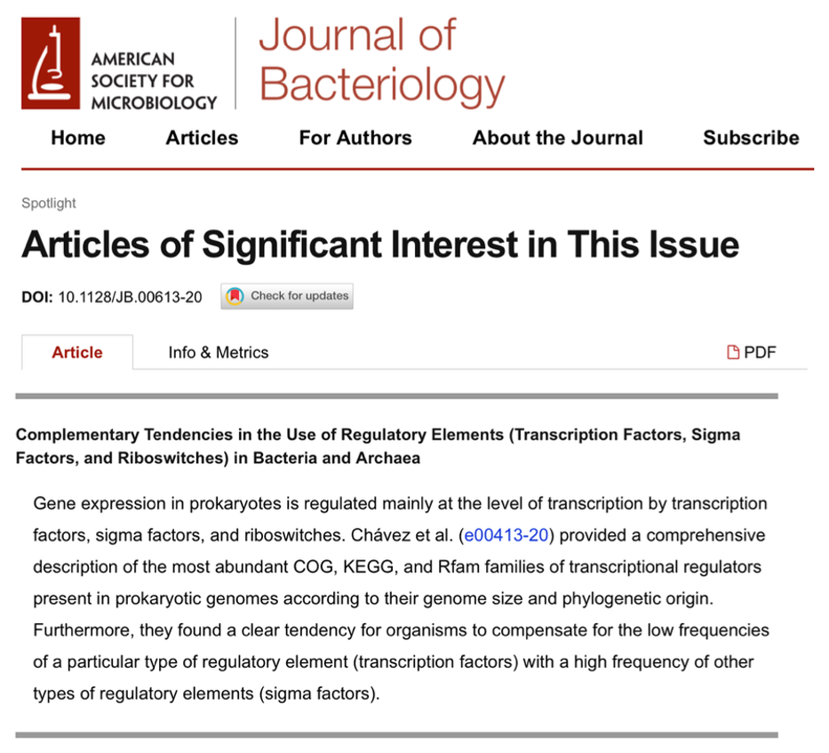
```
]

---
class: chapter-slide

# The regutools package

---

```{r, echo=FALSE}
library(knitr)
library(dplyr)
library(GenomicRanges)
options(width = 90)
```

```{r configuracion, include = FALSE}
xaringanExtra::use_clipboard()
```

# The regulonDB database
<br>

- Contains transcriptional regulatory data from *Escherichia coli* K12.
- Is one of the better curated databases.
- Compiles experimental and bioinformatics data collected across more than 20 years.
- Is continuously updated.

.center[
<http://regulondb.ccg.unam.mx>
]

[
```{r,out.width='65%',echo=FALSE,fig.align='center'}
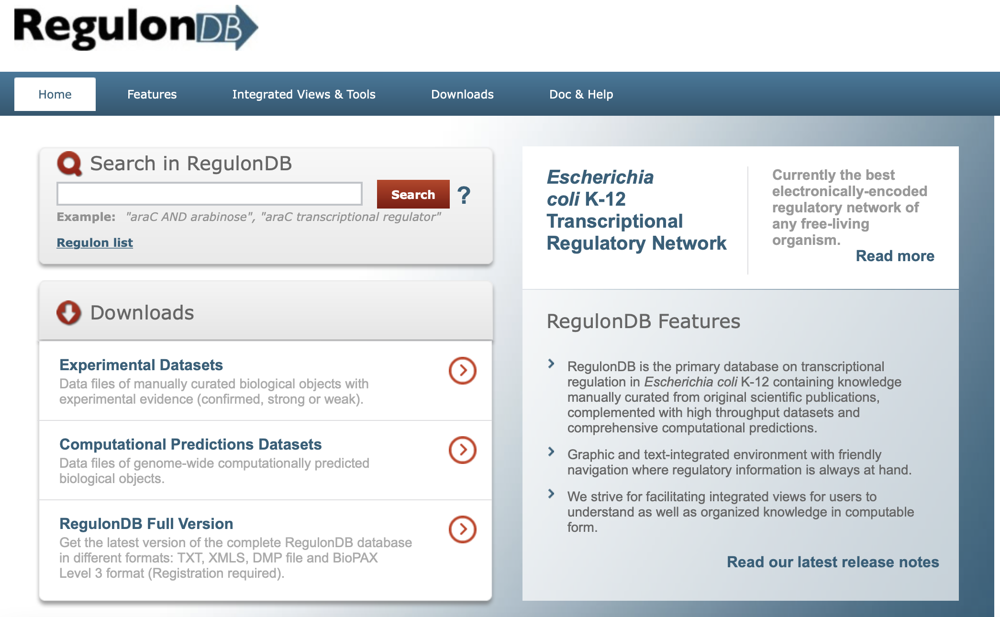
```
](http://regulondb.ccg.unam.mx)

---
# Regutools facilitates the access to regulonDB in a programmatic way
<br><br>

```{r,echo=FALSE,out.width='100%',fig.align='center'}

```

---
# Regutools allows to work with the database off-line

### Pros: 

- Independence from the internet connection.
- The database is stored temporary.
- If you prefer, you can store the database permanently.

### Cons:
- You must download the database everytime regulonDB launches a new version.

---
# Connecting with the database

- The database is stored separately from the main package.

- We use connection through Annotation_db()

```{r,eval=FALSE}
regulondb_conn <- connect_database()
```

- You can store the database in a permanent location.
```{r,echo=FALSE, warning=FALSE,message=FALSE}
library(BiocFileCache)
library(regutools)
```

```{r,message=FALSE}
regulondb_conn <- connect_database(bfc = BiocFileCache("base"))
```

---
# The regulondb object
<br>

.left-column[
- An S4 object

- Preserves the metadata from the database through the downstream analysis.

- Will be crucial for future implementation of other genomes.

- Each regutools function have as first argument the regulondb object.
]

.right-column[
```{r}
e_coli_regulondb <-
    regulondb(
        database_conn = regulondb_conn,
        organism = "E.coli",
        database_version = "v10.8",
        genome_version = "1"
    )
```
]

--
<br><br>
.right-column[
```{r}
e_coli_regulondb
```
]

---
class: chapter-slide

# Data exploration

---
# You can list the available datasets

```{r}
list_datasets(e_coli_regulondb)
```

# Each dataset contains different columns

```{r}
list_attributes(e_coli_regulondb, "GENE")
```

---
```{r}
list_attributes(e_coli_regulondb, "DNA_OBJECTS")
```

```{r}
list_attributes(e_coli_regulondb, "PROMOTER")
```

```{r}
list_attributes(e_coli_regulondb, "TF") %>% head()
```

---
# You can access to a full dataset
<br>
```{r, eval=FALSE}
get_dataset(e_coli_regulondb,"GENE")
```

The output will always be a regulondb_result

```{r}
get_dataset(e_coli_regulondb,"GENE") %>% class()
```

You can retrieve, select and filter data in two ways:

- Converting the regulondb_result to a data frame or tibble (integration with the tidyverse).
- Using the filtering arguments from the function.

---
## Using the filtering arguments from the function

* Columns selection
```{r}
get_dataset(e_coli_regulondb, "GENE",
            attributes = c("id", "name", "strand", "sigma_factor"))
```

With the argument **attributes** you can list all desired columns or **atributos** to retrieve.
---
* Filtering

```{r}
get_dataset(e_coli_regulondb, "GENE",
            attributes = c("id", "name", "strand", "sigma_factor"),
            filters = list(sigma_factor = "Sigma54",
                           strand = "forward"))
```

Use **filters** to specify conditions to match.

Use a **list** format to enumerate all **filters** you want to apply.

---
```{r}
get_dataset(e_coli_regulondb, "GENE",
            attributes = c("id", "name", "strand", "sigma_factor"),
            filters = list(name = "araC"))
```

Use **partialmatch** to use pattern search for filtering.

```{r}
get_dataset(e_coli_regulondb, "GENE",
            attributes = c("id", "name", "strand", "sigma_factor"),
            filters = list(name = "ara", strand = "forward"),
            partialmatch = "name")
```

---
class: chapter-slide
# Evaluate the genomic position of regulatory elements

---
# Retrieve all genes within a genomic range

Use the **interval** argument to specify the columns where to look for genomic positions.

```{r}
get_dataset(e_coli_regulondb, "GENE",
            attributes = c("id", "name", "strand", "posright", "posleft"),
            filters = list(strand = "forward",
                           posright = c("10000", "30000")),
            interval = "posright")
```

---
# Retrieve all the regulatory elements within a genomic range

* By deafult only shows genes
```{r}
get_dna_objects(e_coli_regulondb,
                grange = GRanges("chr", IRanges(1, 5000)))
```
---
* You can choose from "-10 promoter box", "-35 promoter box", "gene", "promoter", "Regulatory Interaction", "sRNA interaction", or "terminator".

```{r}
get_dna_objects(e_coli_regulondb,
                grange = GRanges("chr", IRanges(200, 3000)),
                elements = c("gene", "promoter") )
```

---
# Integration with other Bioconductor packages to plot genomic elements

```{r,echo=FALSE}
e_coli_regulondb <-
    regulondb(
        database_conn = regulondb_conn,
        organism = "chr",
        database_version = "1",
        genome_version = "1"
    )
```

```{r,fig.align='center',out.width='40%'}
plot_dna_objects(e_coli_regulondb,
                 grange = GRanges("chr", IRanges(200, 3000)),
                 elements = c("gene", "promoter") )
```

---
class: chapter-slide
# Transcriptional regulatory networks

---
.pull-left[
# Get the gene regulators
<br>
```{r}
get_gene_regulators( e_coli_regulondb,
                     genes = c("araC"),
                     output.type = "TF" )
```
]

.pull-right[
# Get all regulated genes from a given Transcription factor

```{r}
get_regulatory_network(e_coli_regulondb,
                       regulator = "AraC",
                       type = "TF-GENE")
```
]

---
# Integration with Cytoscape
<br>
.pull-left[<br><br>
```{r,eval=FALSE}
get_regulatory_network(
  e_coli_regulondb,
  regulator = "AraC",
  type = "TF-GENE",
  cytograph = TRUE)
```
]

.pull-right[
```{r,echo=FALSE,out.width='100%'}
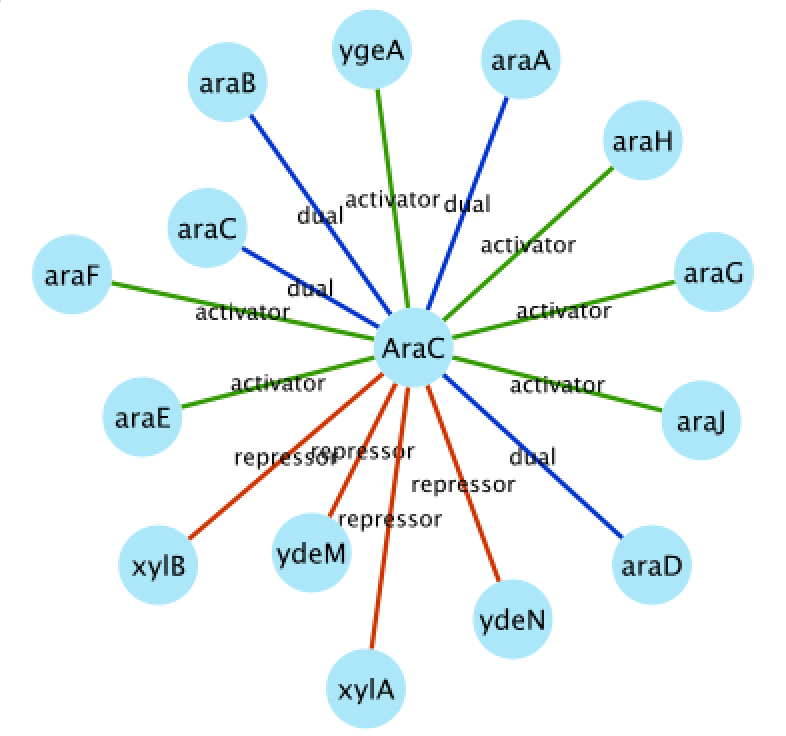
```
]
---
# Retrieving TF binding sites to forward analysis

```{r}
get_binding_sites(e_coli_regulondb, transcription_factor = "AraC")
```

---
# regutols is available on Bioconductor

.pull-left[
.center[<https://bioconductor.org/> ]

```{r,echo=FALSE,out.width='100%'}
include_graphics("img/bioconductor_regutools.png")
```
]

.pull-right[
.center[August 2020]
```{r, echo=FALSE,out.width='90%', fig.align='center'}
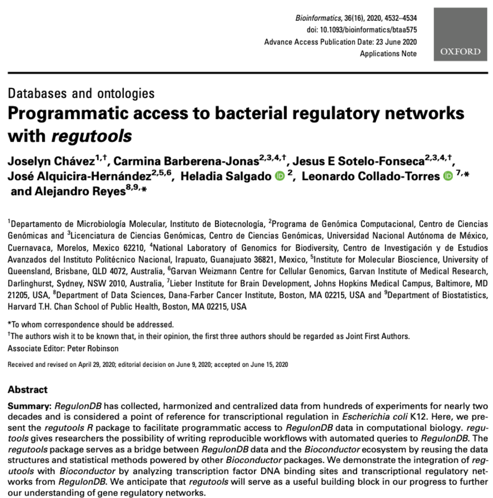
```
]

---
class: middle, center

```{r, echo=FALSE,out.width='30%', fig.align='center'}

```

# Thanks for your attention!

---
class: chapter-slide, center, middle

## Slides created using the [xaringan](https://github.com/yihui/xaringan) package from Yihui Xie and the theme [ms](https://github.com/josschavezf/seminario_ago_2021) from Joselyn Chávez.
